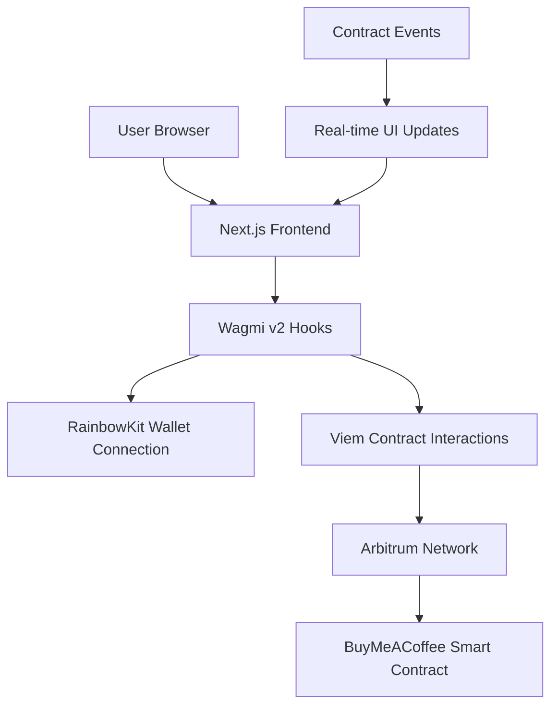
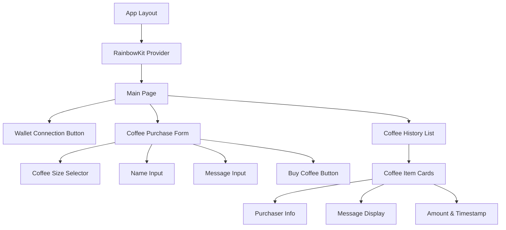

# Design Document

## Overview

The Buy Me a Coffee MVP is a Web3 decentralized application that allows users to send cryptocurrency tips to the contract owner on the Arbitrum network. The application features a clean, responsive interface built with Next.js 15, Wagmi v2, and RainbowKit v2, providing seamless wallet integration and blockchain interactions.

The design focuses on simplicity and user experience, with a coffee-themed interface that makes Web3 interactions approachable for both crypto-native and newcomers. The smart contract is already deployed and provides all necessary backend functionality.

## Architecture

### High-Level Architecture



### Technology Stack

- **Frontend Framework**: Next.js 15 with App Router
- **Blockchain Integration**: Wagmi v2 + Viem
- **Wallet Connection**: RainbowKit v2
- **Styling**: TailwindCSS
- **Type Safety**: TypeScript
- **Network**: Arbitrum One & Arbitrum Sepolia

### Component Architecture



## Components and Interfaces

### 1. Core Configuration (`src/wagmi.ts`)

**Purpose**: Configure Wagmi and RainbowKit with Arbitrum networks

**Key Features**:
- Support for both Arbitrum One (mainnet) and Arbitrum Sepolia (testnet)
- WalletConnect integration
- SSR support for Next.js

**Interface**:
```typescript
export const config: Config
```

### 2. Contract Integration (`src/lib/useContract.ts`)

**Purpose**: Custom hooks for smart contract interactions

**Key Hooks**:
- `useGetAllCoffees()`: Fetch all coffee purchases
- `useBuyCoffee()`: Execute coffee purchase transaction
- `useGetBalance()`: Get contract balance
- `useGetRecentCoffees()`: Fetch recent coffee purchases

**Interface**:
```typescript
export function useGetAllCoffees(): UseReadContractReturnType
export function useBuyCoffee(): {
  buyCoffee: (name: string, message: string, value: bigint) => void
  hash: `0x${string}` | undefined
  isConfirming: boolean
  isConfirmed: boolean
  isPending: boolean
  error: Error | null
}
```

### 3. Main Layout (`src/app/layout.tsx`)

**Purpose**: Root layout with Web3 providers

**Key Features**:
- Wagmi provider configuration
- React Query client setup
- RainbowKit provider wrapper
- Global styling imports

### 4. Home Page (`src/app/page.tsx`)

**Purpose**: Main application interface

**Key Features**:
- Wallet connection status detection
- Conditional rendering based on connection state
- Responsive grid layout for desktop/mobile
- Coffee-themed branding

### 5. Coffee Purchase Form (`src/components/BuyCoffeeForm.tsx`)

**Purpose**: Interface for purchasing coffee

**Key Features**:
- Coffee size selection (Small: 0.001 ETH, Medium: 0.003 ETH, Large: 0.005 ETH)
- Name input with validation
- Optional message input
- Transaction status feedback
- Form reset after successful purchase

**State Management**:
```typescript
interface FormState {
  name: string
  message: string
  selectedSize: 'small' | 'medium' | 'large'
}
```

### 6. Coffee History (`src/components/CoffeeList.tsx`)

**Purpose**: Display recent coffee purchases

**Key Features**:
- Real-time data fetching from smart contract
- Reverse chronological order (newest first)
- Responsive card layout
- Loading and error states
- Empty state handling

**Data Structure**:
```typescript
interface Coffee {
  from: string
  timestamp: bigint
  name: string
  message: string
  amount: bigint
}
```

### 7. Contract Configuration (`src/lib/contract.json`)

**Purpose**: Store contract address and ABI

**Structure**:
```json
{
  "address": "0x...",
  "abi": [...]
}
```

## Data Models

### Coffee Purchase Model

```typescript
interface Coffee {
  from: `0x${string}`      // Purchaser's wallet address
  timestamp: bigint        // Block timestamp
  name: string            // Purchaser's display name
  message: string         // Optional message
  amount: bigint          // Amount sent in wei
}
```

### Coffee Size Configuration

```typescript
const COFFEE_PRICES = {
  small: parseEther('0.001'),   // 0.001 ETH
  medium: parseEther('0.003'),  // 0.003 ETH
  large: parseEther('0.005'),   // 0.005 ETH
} as const
```

### Transaction State

```typescript
interface TransactionState {
  hash?: `0x${string}`
  isConfirming: boolean
  isConfirmed: boolean
  isPending: boolean
  error: Error | null
}
```

## Error Handling

### 1. Wallet Connection Errors

**Scenarios**:
- User rejects connection
- Unsupported wallet
- Network mismatch

**Handling**:
- Display user-friendly error messages
- Provide retry mechanisms
- Guide users to correct network

### 2. Transaction Errors

**Scenarios**:
- Insufficient funds
- Gas estimation failure
- Transaction rejection
- Network congestion

**Handling**:
```typescript
try {
  await buyCoffee(name, message, amount)
} catch (error) {
  if (error.code === 'ACTION_REJECTED') {
    setError('Transaction was cancelled')
  } else if (error.code === 'INSUFFICIENT_FUNDS') {
    setError('Insufficient funds for transaction')
  } else {
    setError('Transaction failed. Please try again.')
  }
}
```

### 3. Contract Interaction Errors

**Scenarios**:
- Contract not found
- Invalid function calls
- Network connectivity issues

**Handling**:
- Graceful degradation
- Retry mechanisms with exponential backoff
- Clear error messaging

### 4. Form Validation Errors

**Scenarios**:
- Empty name field
- Invalid input characters
- Message too long

**Handling**:
- Real-time validation
- Clear field-level error messages
- Prevent form submission until valid

## Testing Strategy

### 1. Unit Testing

**Components to Test**:
- Custom hooks (`useContract.ts`)
- Form validation logic
- Utility functions
- Component rendering

**Tools**: Jest, React Testing Library

**Example Test Cases**:
```typescript
describe('useBuyCoffee', () => {
  it('should handle successful coffee purchase', async () => {
    // Test successful transaction flow
  })
  
  it('should handle transaction rejection', async () => {
    // Test error handling
  })
})
```

### 2. Integration Testing

**Scenarios**:
- End-to-end coffee purchase flow
- Wallet connection and disconnection
- Network switching
- Contract interaction with test data

**Tools**: Playwright or Cypress

### 3. Contract Testing

**Already Implemented**: Smart contract has comprehensive test suite

**Frontend Contract Integration**:
- Test with local Hardhat network
- Verify ABI compatibility
- Test event listening and parsing

### 4. Manual Testing Checklist

**Wallet Integration**:
- [ ] Connect with MetaMask
- [ ] Connect with WalletConnect
- [ ] Switch networks
- [ ] Disconnect wallet

**Coffee Purchase Flow**:
- [ ] Select different coffee sizes
- [ ] Enter valid/invalid names
- [ ] Submit with/without messages
- [ ] Handle transaction success/failure

**Responsive Design**:
- [ ] Mobile layout (320px - 768px)
- [ ] Tablet layout (768px - 1024px)
- [ ] Desktop layout (1024px+)

## Performance Considerations

### 1. Bundle Optimization

**Strategies**:
- Code splitting for wallet connectors
- Lazy loading of non-critical components
- Tree shaking of unused dependencies
- Dynamic imports for heavy libraries

### 2. Blockchain Data Caching

**Implementation**:
```typescript
// Wagmi automatically handles caching
const { data: coffees } = useReadContract({
  address: CONTRACT_ADDRESS,
  abi: CONTRACT_ABI,
  functionName: 'getAllCoffees',
  // Automatic caching and refetching
})
```

### 3. Real-time Updates

**Strategy**:
- Use Wagmi's built-in cache invalidation
- Listen to contract events for real-time updates
- Implement optimistic updates for better UX

### 4. Loading States

**Implementation**:
- Skeleton loaders for data fetching
- Progressive loading of coffee history
- Immediate feedback for user actions

## Security Considerations

### 1. Input Validation

**Frontend Validation**:
```typescript
const validateName = (name: string): boolean => {
  return name.trim().length > 0 && name.length <= 50
}

const validateMessage = (message: string): boolean => {
  return message.length <= 280 // Twitter-like limit
}
```

### 2. Transaction Safety

**Measures**:
- Clear transaction preview before signing
- Amount validation and formatting
- Gas estimation with buffer
- Transaction timeout handling

### 3. Contract Interaction Safety

**Practices**:
- Use typed contract interfaces
- Validate contract responses
- Handle contract upgrade scenarios
- Implement circuit breakers for critical failures

### 4. User Data Protection

**Measures**:
- No sensitive data storage in localStorage
- Sanitize user inputs before display
- Prevent XSS through proper escaping
- Use HTTPS for all external requests

## Deployment Strategy

### 1. Environment Configuration

**Development**:
```env
NEXT_PUBLIC_WALLETCONNECT_PROJECT_ID=dev_project_id
NEXT_PUBLIC_CONTRACT_ADDRESS=0x... # Sepolia testnet
NEXT_PUBLIC_NETWORK=arbitrumSepolia
```

**Production**:
```env
NEXT_PUBLIC_WALLETCONNECT_PROJECT_ID=prod_project_id
NEXT_PUBLIC_CONTRACT_ADDRESS=0x... # Arbitrum mainnet
NEXT_PUBLIC_NETWORK=arbitrum
```

### 2. Build Process

**Steps**:
1. TypeScript compilation
2. Next.js optimization
3. Asset optimization
4. Bundle analysis
5. Static export (if needed)

### 3. Hosting Options

**Recommended**: Vercel
- Automatic deployments from Git
- Edge network distribution
- Built-in analytics
- Environment variable management

**Alternative**: Netlify, AWS S3 + CloudFront

### 4. Monitoring and Analytics

**Metrics to Track**:
- Wallet connection success rate
- Transaction completion rate
- Error rates by type
- User engagement metrics
- Performance metrics (Core Web Vitals)

## Future Enhancements

### 1. Advanced Features

**Potential Additions**:
- Coffee purchase history for individual users
- Leaderboard of top supporters
- Custom coffee amounts
- Recurring coffee subscriptions
- Social sharing of coffee purchases

### 2. Technical Improvements

**Optimizations**:
- GraphQL integration for better data fetching
- Service worker for offline functionality
- Push notifications for new coffee purchases
- Advanced caching strategies

### 3. Multi-chain Support

**Expansion**:
- Ethereum mainnet support
- Polygon integration
- Base network support
- Cross-chain coffee purchases

This design provides a solid foundation for building a production-ready Buy Me a Coffee dapp that is secure, performant, and user-friendly while leveraging the latest Web3 development practices.